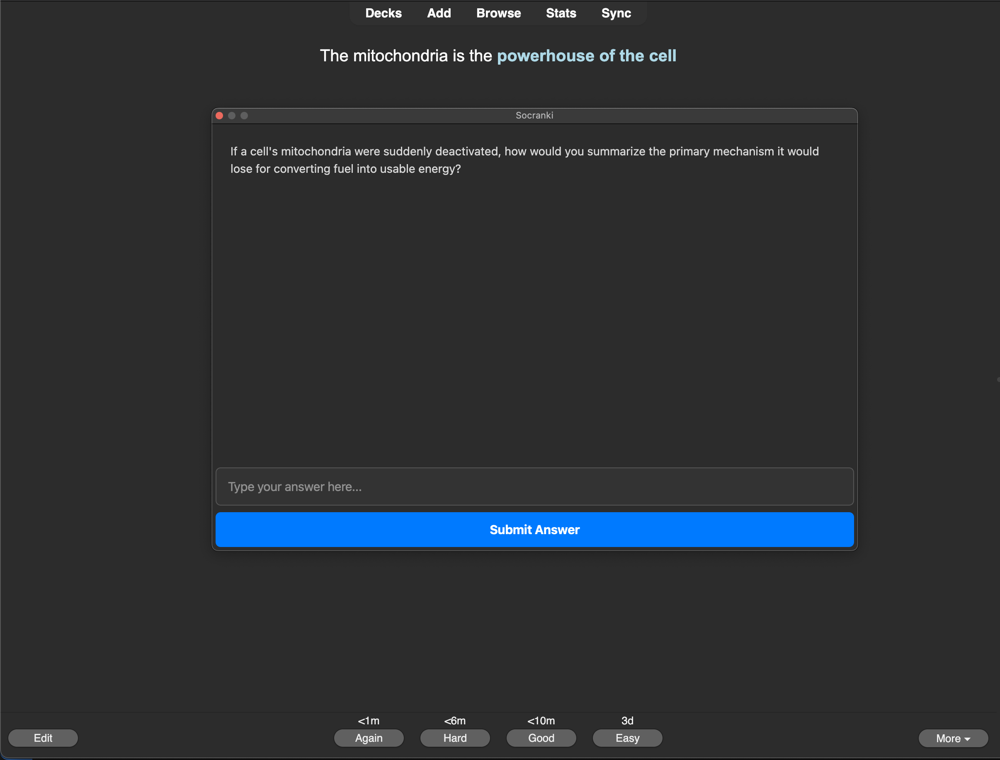

# Socranki: The Socrates of Anki

Socranki is an AI-powered add-on that transforms your Anki review sessions into interactive Socratic dialogues. Instead of just flipping cards, Socranki asks deep, follow-up questions to test your true comprehension and help you form stronger mental connections.

## Key Features
- **Socratic dialogue**: Generates pertinent follow-up questions by gathering context (similar tagged cards, [connected cards by `nid`](https://ankiweb.net/shared/info/1077002392), surrounding cards). Question complexity is based on current card's age by following Bloom's Taxonomy (Understanding, Applying, Analyzing).
- **Interactive evaluation (Chit-Chat)**: Submit your answers to the AI for clinical, direct feedback.
- **Auto-adaptation**: Automatically tags cards based on your performance (`good_comprehension` or `needs_comprehension`) and adjusts the difficulty of future questions.
- **Flexible backends**: Supports local LLMs (Ollama) as well as APIs (OpenAI, Gemini, and compatibles)
- **Modern UI**: A sleek, dockable, dark-mode compatible interface with full Markdown and MathJax/LaTeX support.

## Setup
1. Install the add-on.
2. Go to **Config** (or `Add-ons > Socranki > Config`).
3. Enter your **API Key** or leave it blank to use your local LLM (Ollama).
4. Choose your **Interaction Mode**:
   - **Chit-Chat**: Interactive chat where you submit answers.
   - **One-Liner**: Fast mode where the AI shows a question and an ideal hidden answer.
5. (Optional) Customize the **AI Personality** to make your tutor sound however you like.

## Performance
Socranki is built to be extremely lightweight. All database lookups and AI requests happen in the background, ensuring your card-flipping experience remains buttery smooth even with massive decks.

Made by [moo-dy](https://github.com/moo-dy)
